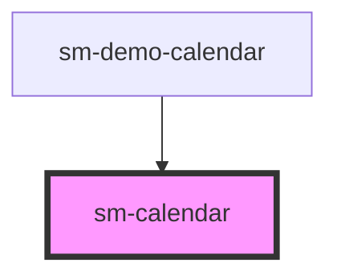

# sm-calendar

<!-- Auto Generated Below -->

## Properties

| Property           | Attribute            | Description      | Type       | Default                                 |
| ------------------ | -------------------- | ---------------- | ---------- | --------------------------------------- |
| `availableViews`   | --                   | availableViews   | `string[]` | `[VIEWS.day, VIEWS.week, VIEWS.month]`  |
| `contextDate`      | `context-date`       | contextDate      | `string`   | `moment().format(INTERNAL_FORMAT.DATE)` |
| `events`           | --                   | events           | `object[]` | `[]`                                    |
| `showContextPanel` | `show-context-panel` | showContextPanel | `boolean`  | `true`                                  |
| `theme`            | `theme`              | Theme            | `string`   | `'lightseagreen'`                       |
| `timezone`         | `timezone`           | timezone         | `string`   | `'GMT'`                                 |
| `view`             | `view`               | view             | `string`   | `VIEWS.week`                            |
| `weekStartDay`     | `week-start-day`     | weekStartDay     | `string`   | `'sun'`                                 |

## Events

| Event         | Description | Type               |
| ------------- | ----------- | ------------------ |
| `cellClick`   |             | `CustomEvent<any>` |
| `eventClick`  | Events      | `CustomEvent<any>` |
| `eventUpdate` |             | `CustomEvent<any>` |
| `viewChange`  |             | `CustomEvent<any>` |

## Dependencies

### Used by

 - [sm-demo-calendar](../sm-demo-calendar)

### Graph

----------------------------------------------

*Built with [StencilJS](https://stenciljs.com/)*
