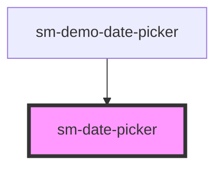

# sm-date-picker

<!-- Auto Generated Below -->

## Properties

| Property       | Attribute        | Description  | Type      | Default                          |
| -------------- | ---------------- | ------------ | --------- | -------------------------------- |
| `date`         | `date`           | date         | `string`  | `moment().format(INTERNAL_DATE)` |
| `label`        | `label`          | label        | `string`  | `undefined`                      |
| `showPicker`   | `show-picker`    | showPicker   | `boolean` | `false`                          |
| `theme`        | `theme`          | Theme        | `string`  | `'teal'`                         |
| `weekStartDay` | `week-start-day` | weekStartDay | `string`  | `'sun'`                          |

## Events

| Event          | Description | Type               |
| -------------- | ----------- | ------------------ |
| `dateSelected` |             | `CustomEvent<any>` |

## Dependencies

### Used by

 - [sm-demo-date-picker](../sm-demo-date-picker)

### Graph

----------------------------------------------

*Built with [StencilJS](https://stenciljs.com/)*
